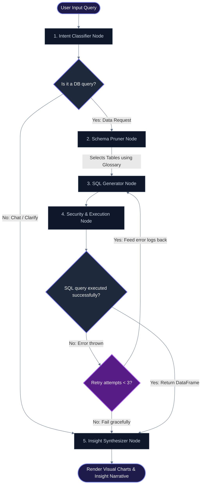

# ⚡ Enterprise SQL Agent

An intelligent, self-healing natural language query agent powered by **LangGraph** and **Streamlit**. Talk directly to operational databases in plain English, scale queries up to hundreds of tables with dynamic schema pruning, visualize insights automatically, and run database queries with strict data privacy guards.

---

## 🚀 Key Features

*   **Stateful Self-Healing Loop (LangGraph)**: Automatically captures SQL execution syntax errors and feeds them back to the LLM to self-heal and retry query compilation in real-time.
*   **Dynamic Schema Pruning**: Scales to large enterprise databases by dynamically identifying and mapping the top 3-5 relevant tables based on the user's intent and business glossary—preventing context window crashes and hallucinations.
*   **Premium Dark SaaS Interface**: Fully customized Streamlit dashboard featuring glassmorphic telemetry cards, hover micro-animations, glowing focus states, and isolated session workspaces.
*   **Structured Data Privacy Guard**: Choose your data sharing level (`Standard`, `DDL Only`, or `DDL + Sample Rows`) to prevent sensitive production data rows from being sent to external LLM APIs.
*   **Auto-Charting & Visualization**: Automatically detects numeric columns (correcting SQLAlchemy decimal-type bugs) and renders recommended visual charts (Bar, Line, Scatter, Pie) dynamically.
*   **Dual Environment Isolation**: Swap seamlessly between a local **22-table College ERP Sandbox** and your **custom production database connections** without bleeding session history.

---

## 🛠️ Technology Stack

*   **Agent Orchestration**: **LangGraph** (Stateful multi-node graphs, state storage, and dynamic error-feedback routing).
*   **Frontend UI/UX**: **Streamlit** (Glassmorphic styling, custom CSS animations, and live status executors).
*   **Large Language Models**: Multi-provider client wrapper supporting **Gemini** (Google), **OpenAI**, **Groq** (Llama 3), and **Ollama** (local offline execution).
*   **Database Engines & ORM**: **SQLAlchemy** (database schema crawling and connection abstraction) with **SQLite / PostgreSQL** compatibility.
*   **Data Processing & Charts**: **Pandas** (dataframe cleansing and type mapping) and **Altair** (declarative charting).

---

## 🛠️ System Architecture

The application runs a stateful graph pipeline using LangGraph:



1.  **Intent Classifier Node**: Determines if the query requires database operations, conversational chat, or clarification.
2.  **Metadata Schema Pruner Node**: Uses semantic descriptions to select only matching tables, returning pruned DDL schemas to minimize tokens.
3.  **SQL Generator Node**: Builds an optimized SQL query based on pruned DDL inputs and business glossary definitions.
4.  **Security & Execution Node**: Safely executes queries. If a query syntax error is thrown, it acts as a self-healing node, sending error logs back to the generator for automated fixes.
5.  **Insight Synthesizer Node**: Formulates clear natural language summaries and recommends matching charting structures.

---

## 📦 Installation & Setup

### Prerequisites
- Python 3.9 or higher
- Access to an LLM API key (Gemini, OpenAI, Groq, or local Ollama)

### 1. Clone the Repository & Install Dependencies
```bash
pip install -r requirements.txt
```

### 2. Set Up Environment Variables (Optional)
Create a `.env` file in the root directory to store your API credentials:
```env
GROQ_API_KEY=gsk_your_key_here
OPENAI_API_KEY=sk_your_key_here
GEMINI_API_KEY=your_key_here
```

### 3. Run the Streamlit Application
```bash
streamlit run app.py
```

---

## 📖 Using a Custom Business Glossary

When connecting a custom production database (e.g., PostgreSQL), you can paste a custom business glossary in JSON format to help the agent map user terminology to database tables and columns:

```json
{
  "business_glossary": {
    "students": "Profiles of enrolled students. Fields: first_name, last_name, enrollment_date, status. Links: belongs to programs."
  },
  "column_descriptions": {
    "students.enrollment_date": "The date when the student first enrolled/admitted to the university",
    "students.status": "The general university enrollment status of the student (Active, Suspended, Graduated)"
  }
}
```
Providing these overrides prevents column name ambiguities (e.g., separating university admission dates from individual class registration enrollment dates) and guarantees high-fidelity SQL queries.
